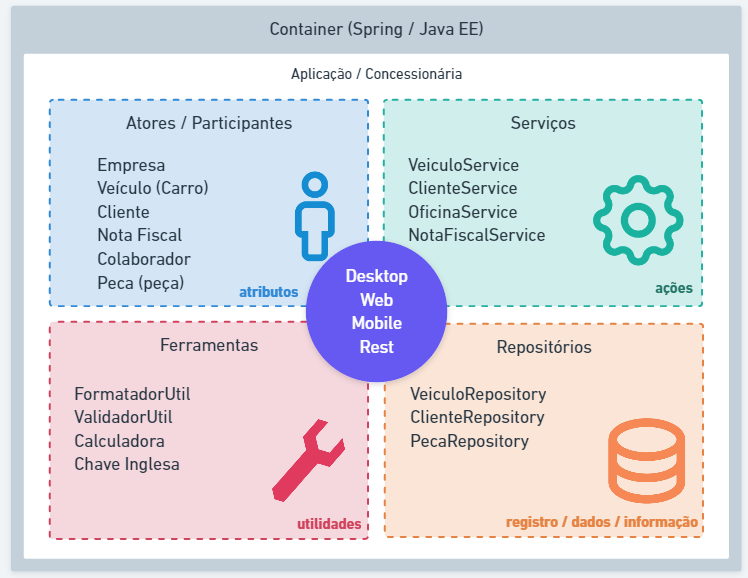

# Conceitos de POO
___

À medida que a tecnologia vem evoluindo, as linguagens de programação também, e a esta transição natural que determina 
quando estamos nos referindo a liguagem de baixo e alto n�vel.

-**Baixo nível:** São linguagens que estão mais próxima da interpretação da máquina diante do algoritmo desenvolvido. Exemplo: 
**Assembly** e **C**.

-**Alto nível:** São linguagens que disponibilizam uma proposta de sintaxe mais próxima de interpretação humana. Exemplo: 
**Java**, **JavaScript**, **Python** e **C+**

Exemplo simples de _Hello world_ em **Assembly** e em **Python**:

**ASSEMBLY**
```
section .text
    global _start
_start:
    mov edx, len
    mov ecx, msg
    mov ebx, 1
    mov eax, 4
    int 0x80
    mov eax, 1
    int 0x80
section .data
msg db 'Hello, world!', 0xa
len equ $ - msg
```

**PYTHON**
```
print("Hello, world!")
```

## Programação Estruturada
___

A **Programação Estruturada** é um paradigma de programação que visa melhorar a clareza, a qualidade e o tempo de desenvolvimento
de um programa de computador, fazendo uso extensivo das construções de fluxo de controle estruturado de seleção (if/then/else)
e repetição (while/for), estruturas de bloco e subrotinas.

O que devemos ter em mente é que na programação  estruturada, implementamos algoritmos com estruturas sequenciais denominados
de procedimentos lineares. podendo afetar o valor das variáveis de escopo local ou global em uma aplicação.


## Programação Orientada a Objetos - POO
___

POO � um paradigma de programação baseado no conceito de _objetos_ que podem conter dados na forma de campos, também conhecidos
como atributos, e códigos na forma deprocedimentos, também conhecidos como métodos.

O que precisamos entender, é que cada vez mais linguagens se adequam ao cenário real, proporcionando assim que o programador
desenvolva algoritmos mais próximos de fluxos comportamentais, logo, tudo ao nosso redor é representado como um Objeto.

    Enquanto a programação estruturada é voltada a procedimentos e funções definidas pelo usuário,
    a programação orientada a objetos é voltada a conceitos, como o de Classes e Objetos.


## Classes
___

Toda estrutura de código na linguagem Java é distribuído em arquivos com extensão *.java* denominados de **classes**. As
classes existentes em nossos projetos serão compostas por: **identificador**, **características** e **comportamentos**.
- **Classe** (class): A estrutura e ou representação que direciona a criação dos objetos de mesmo tipo;
- **Identificador** (identity): Propósito existencial aos objetos que serão criados;
- **Características** (states): Também conhecido como  **atributos** ou **propriedades**. é toda informação que representa o estado do objeto;
- **Comportamentos** (behavior): Também conhecido como **ações** ou **métodos**. é toda a parte comportamental que um objeto dispõe;
- **Instanciar** (new): é o ato de criar um objeto à partir de uma estrutura definida em uma classe.


Seguindo algumas convenções, as nossas classes são classificadas como:
- **Classe de Modelo** (model): Classes que representem a estrutura de domínio da aplicação, como por exemplo: Cliente, Pedido, NotaFiscal, etc.;
- **Classe de Serviço** (service): Classes que contém regras de negócio e validação de nosso sistema;
- **Classe de Repositório** (repository): Classes que contém uma integração com Banco de Dados;
- **Classe de Controle** (controller): Classes que possuem a finalidade de disponibilar alguma comuninação externa para a nossa aplicação, como _http_ _web_ e _webservices_;
- **Classe Utilitária** (util): Classe que contem recursos comuns à toda nossas aplicação.



## Pacotes
___

A linguagem Java é composta por milhares de classess com as finalidades de, por exemplo: Classes de tipos de dados, representação
de texto, números, datas, arquivos, diretórios, conexão com banco de dados, entre outras. Imagina atodas essas classes existirem
em um único nível de documentos?  

Para prevenir a desorganização, a linguagem dispõe de um recurso que organiza as classes padrões criadas por nós, que conhecemos
como _packages_ (pacotes). Os pacotes são subdiretórios à partir da pasta *src* do nosso projeto, onde estão localizadas as 
classes da linguagem e novas classes que forem criadas para o projeto. Existem algumas convenções par a criação de pacotes
já utilizadas no mercado.


### Nomeclatura

Vamos imaginar que a sua empresa se chama **Power Soft**. e ela está desenvolvendo software comercial, governamental e um software
livre ou de código aberto. Abaixo teríamos os pacotes sugeridos conforme a tabela abaixo:

| Tipo          | Pacote          |
|---------------|-----------------| 
| **Comercial** | _com.powersoft_ |
| **Governamental** | _gov.powersoft_ |
| **Código aberto** | _org.powersoft_ |

Bem, acimajá pudemos observar que existe uma definição para o uso do nome dos pacotes, porém podemos organizar ainda mais um
pouco as nossas classes mediante a proposta de sua existência:
- **model**: Classes que representam a camada e modelo da aplicação: Cliente, Pedido, NotaFiscal, Usuario;
- **repository**: Classes ou interfaces que possuem a finalidade de interagir com tabelas no banco de dados: ClienteRepository;
- **service**: Classes que contém as regras de negócio do sistema: ClienteService possui o método validar o CPF do cliente cadastrado;
- **controller**: Classes que possuem a finalidade de si´ponibilizar os nossos recursos da aplicação para outras aplicações via padrão HTTP;
- **view**: Classes que possuem altuma interação com a interface gráfica acessada pelo usuário;
- **util**: Pacote que contém classes utilitárias do sistema: FormatadorNumeroUtil, ValidadorUtil.


### Identificação

Uma das características de uma classe é a sua identificação: Cliente, NotaFiscal, TituloPagar... Porém quando esta classe é 
organizada por pacotes, ela passa a ter duas identificações: O nome simples, e agora o nome qualificado (**endereçamento do pacote + nome**).
Por exemplo, considere a classe __Usuario__, que está endereçada no pacote __com.controle.acesso.model__, o nome qualificado
desta classe é __com.controle.acesso.model.Usuario__.


### Package _versus_ Import

A localização de uma classe é definida pela palavra reservada _package_, logo, uma classe só contém uma definição de package
no arquivo, sempre na primeira linha do código. Para a utilização de uma classe existente em outros pacotes, necessitamos realizar a importação
das mesmas, seguindo as recomendações abaixo:

```
package

import...
import...

public class MinhaClasse {
}
```

### Por que é tão impoortante compreender os pacotes?

A linguagem Java é composta por milhares de classes internas, classes desenvolvidas em projetos disponíveis através de bibliotecas,
alpem das classes do próprio projeto. Logo, existe uma enorme prossibilidade da existência de classes de mesmo nome.
É nesta hora que nós desenvolvedores precisamos detectar qual classe iremos importar em nosso projeto.

Um exemplo clássico é a existencia das classes *java.sql.Date* e *java.util.Date* da própria linguagem.


## Visibilidade dos Recursos
___

Em Java, utilizamos três palavras reservadas e um conceito default (sem nenhuma palavra reservada) para definir os quatro tipos
de visibilidade de atributos, métodos e até mesmo classes no que se refere ao acesso por outras classes. Iremos ilustrar do 
mais restrito tipo de visibilidade nos arquivos em nosso projeto.
Para melhor ilustrar, iremos representar os conceitos de visibiçidade de recursos através do contexto de uma lanchonete que
vende lanche natural e suco.

### Modificador public

Como o próprio nome representa, quando nossa classe, método e atributo é definido como **public**, qualquer outra classe em 
qualquer outro pacote pode visualizar tais recursos.


### Modificador default

O modificador default está fortemente associado à organização de classes por pacotes. Algumas implementações não precisam estar
disponíveis por todo o projeto, e este modificador de acesso restringe a visibilade por outros pacotes.


### Modificador private

O modificador private garante que os métodos e aributos estejam visíveis e acessíveis **somente dentro da própria classe**
onde o mesmo é declarado.

    A visibilidade de recursos dalinguagem nã está associada à **interface gráfica**, mas sim ao que as classes conseguem 
    acessar uma das outras


## Getters e Setters
___

Segundo a convenção Java Beans, os métodos *Getters* e *Setters* são utilizados para buscar valores de atributos ou definir novos
valores de instâncias de classes.
- O método **Getter** retorna o valor do atributo especificado;
- O método **Setter** define um novo valor para o atributo especificado;
- Os atributos precisam ter o modificador de acesso **private**;
- Como agora os atributos estão somente visíveis a nível de classe, precisaremos criar métodos **getX()** e **setX()**, como por exemplo: getNome() e setNome();
- O método **get** é responsável por obter o valor atual do atributo, logo ele precisa ser **public** e retornar um tipo correspondente ao valor. Exemplo: **__public String getNome(){}__**;
- O método **set** é responsável por definir ou modificar o valor de um atributo em um objeto, logo ele também precisa ser **public**, receber um árâmetro do mesmo tipo da variável, mas não retorna valor nenhum. Exemplo: **__public void setNome(String newNome)__**;


## Construtores
___

Sabemos que para criar um objeto na linguagem Java, utilizamos a seguinte estrutura de código:
    
    Classe novoObjeto = new Classe();

Desta forma será criado um novo objeto na memória. Este recurso também é conhecido como instanciar um novo objeto.

É uma boa pática de programação criar construtores utilizando somente atributos necessários para a existencia  da classe, 
e todos os demais devem ser definidos através de métodos setters. Vale mencionar que em determinadas ocasiões, é possível 
adicionar um construtor que não recebe atributos, ou recebe apenas atributos específicos.


## Enums
___

Enum é um tipo especial de classe onde os objetos são previamente criados, imutáveis e disponiveis por toda a aplicação.

Usamos Enum quando o nosso modelo de negócio contém objetos de mesmo contexto que já exitem previamente com a certeza de 
não haver tanta alteração de valores.

Exemplos:

**Grau de Escolaridade:** Analfabeto, Fundamental, Médio, Superior;

**Estado Civil:** Solteiro, Casado, Divorciado, Viúvo;

**Estados Brasileiros:** São Paulo, Rio de Janeiro, Piauí, Maranhão, etc.;

    Não confunda uma lista de constantes com enum.

Enquanto uma constante é uma variável de tipo com valor imutável, **enum** é um conjunto de objetos pré-estabelecidos na aplicação.

Como um **enum** é um conjunto de objetos, logo estes objetos podem conter atributos e métodos.


## Pilares do POO
___

**Programação Orientada a Objetos** (POO ou OOP) é um paradigma de programção baseado no conceito  de objetos, que podem 
conter *dados na forma de campos*, também conhecidos como atributos e códigos, ou na forma de *procedimentos*, também conhecidos
como métodos.

Como se trata de um  contexto análogo ao mundo real, tudo no qal nos referimos são objetos, como por exemplo: uma conta 
bancária, alunos, veículo, transferência, etc.

A programação orientada a objetos é bem requisitada no contexto das aplicações mais atuais no mercado devido à possibilidade
de reutilização de código e a capacidade de representação do sistema ser muito mais próxima do mundo real.

Para uma linguagem ser considerada Orientada a Objetos, esta deve seguir o que denominamos como **Os quatro pilares da orientação a objetos:**
- **Encapsulamento:** Nem tudo precisa estar visível. Grande parte do nosso algoritmo pode ser distribuído em métodos com finalidades específicas que complementam uma ação em nossas aplicação;
- **Herança:** Características e comportamentos comuns podem ser elevados e compartilhados através de uma hierarquia de objetos. Ex: Um carro e uma motocicleta possuem propriedades como placa,chassi, ano de fabricação e métodos como acelerar e frear. Logo, para não ser um processo de codificação redundante, podemos desfrutar da herança criando uma classe **Veiculo**, para que seja herdada por **Carro** e **Motocicleta**;
- **Abstração:** É a indisponibilidade para determinar a lógica de um ou vários comportamentos em um objeto. Ex: **Veiculo** determina duas ações, como *acelerar* e *frear*, logo, estes comportamentos deverão ser abstratos, pois existem mais de uma maneira de se realizar uma mesma operação. Ver *Polimorfismo*
- **Polimorfismo:** São as inúmeras maneiras de se realizar uma mesma ação. Ex: Veículo determina duas ações como *acelerar* e *frear*. Primeiramente precisamos identificar se estaremos nos referindo a **Carro** ou **Motocicleta** para então determinar a lógica de aceleração e frenagem nos respectivos veículos.


### Encapsulamento

Nem tudo precisa estar disponível a todos. Processos utilizados apenas dentro da própria clásse, possuir visibilidade pública
não é um requisito, então não há a necessidade desses dados estarem acessíveis. 

Exemplo de diagrama UML de uma classe  Messenger: 


### Herança

Herança é um princípio de orientação a objetos, que permite que classes compartilhem atributos e métodos, através de "heranças". ]
Ela é usada na intenção de reaproveitar código ou comportamento generalizado ou especializar operações ou atributos.

## Abstração

A abstração na POO é a capacidade de ocultar detalhes irrelevantes ou complexos de um problema e focar nos aspectos essenciais.
 Ela é implementada por meio de classes, que são modelos que descrevem os atributos e comportamentos comuns de um grupo de objetos.

A abstração é um princípio fundamental da Programação Orientada a Objetos que envolve a identificação e a modelagem das
características e comportamentos essenciais de um objeto, ignorando os detalhes irrelevantes ou secundários para o contexto 
em questão. Em essência, a abstração permite aos desenvolvedores criar modelos simplificados de entidades complexas do mundo real,
focando apenas nos aspectos que são importantes para a aplicação sendo desenvolvida.

### Polimorfismo

Um mesmo comportamento, de várias maneiras.

Podemos observar no contexto de Abstração e Herança, que conseguimos criar uma singularidade estrutural de nossos elementos.
Isso quer dizer que, qualquer classe que deseja representar um serviço de mensagens, basta estender a classe ServicoMensagemInstantanea
e implementar, os respectivos métodos abstratos. O que vale reforçar aqui é, cada classe terá a mesma ação, executando 
procedimentos de maneira especializada.


#### Modificador protected

Vamos para uma retrospectiva, quanto ao requisito do nosso sistema de mensagens instantaneas desde a etapa de encapsulamento.

O nosso requisito solicita que além de enviar e receber mensagens, precisamos validar se o aplicativo está conectado à internet e salvar
o histórico de cada mensagem.

Sabemos que cada aplicativo costuma salvar as mensagens em seusm respectivos servidores cloud. Mas e quanto à validar se está conectado 
à internet? Não poderia ser um mexanismo comum a todos? Logo, qualquer classe filha poderia desfrutar desta funcionalidade através da herança.